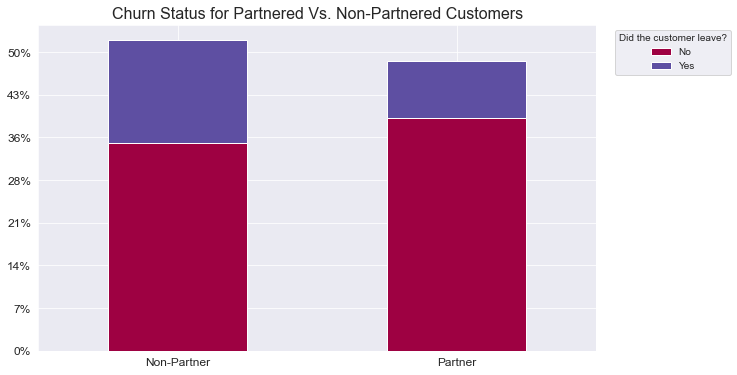

```python
%%HTML
<style type="text/css">
table.dataframe td, table.dataframe th {
    border: 1px  black solid !important;
  color: black !important;
}

hr{ 
  height: 5px;
  color: black;
  background-color: red;
  border: none;
}
</style>
```


<style type="text/css">
table.dataframe td, table.dataframe th {
    border: 1px  black solid !important;
  color: black !important;
}

hr{ 
  height: 5px;
  color: black;
  background-color: red;
  border: none;
}
</style>


```python
    import numpy as np
    import pandas as pd
    import matplotlib.pyplot as plt
    import matplotlib.ticker as mtick
    import seaborn as sns
    from sklearn import svm
    %matplotlib inline
    from IPython.core.display import display, HTML
    import ipywidgets as ipyw
```


```python
def data_reading():
        try:
            data = pd.read_csv('/users/adeekshyagurung/Downloads/Telco.csv', encoding='latin1')
            display(HTML('</br><h1><center> Initial Raw Data </center></h1></br>'))
            display(data.head())
            return data
        except FileNotFoundError:
            print('\nFile not found exception occured while reading the data. Kindly check the location or name of the file!')
            return
```


```python
def data_cleaning(data):

        # Replacing null values with NaN
        data = data.replace(' ', np.nan)

        # Droping all the null values 
        data = data.dropna()
        
        # Converting 'TotalCharges' into float
        data['TotalCharges'] = data['TotalCharges'].astype(float)

        # Assigning continuous values to the column SeniorCitizen
        senior_mapping = {0: "No", 1: "Yes"}
        data['SeniorCitizen'] = data['SeniorCitizen'].map(senior_mapping)

        display(HTML('</br><h1><center> Processed Cleaned Data </center></h1></br>'))
        display(data.head())

        return data
```


```python
def stat_analysis(data):
    display(HTML('<hr class="new1">'))
    
    # Correlation Matrix of Tenure, Monthly Charges, and Total Charges
    display(HTML('</br><h1><center> Correlation between the numerical columns of the data </center></h1></br>'))
    display(data.corr())
    
    # Box plots to check for outliers
    display(HTML('</br><h1><center> Outlier Detection </center></h1></br>'))
    fig, axes = plt.subplots(1,3, figsize=(10,6))
    sns.boxplot(data=data['tenure'], orient='v', ax=axes[0])
    sns.boxplot(data=data['MonthlyCharges'], orient='v', ax=axes[1], color='red')
    sns.boxplot(data=data['TotalCharges'], orient='v', ax=axes[2], color='green')
    plt.tight_layout()
    axes[0].set_title('Tenure')
    axes[1].set_title('Monthly Charges')
    axes[2].set_title('Total Charges')
    plt.show()
```


```python
def show_plots(data):
    
    display(HTML('<hr class="new1">'))
    
    # Histogram using Seaborn (Tenure)
    display(HTML('</br><h1><center> Histogram of Tenure </center></h1></br>'))
    plt.figure(figsize=(12,6))
    sns.set_style('whitegrid')
    sns.distplot(data['tenure'], bins=35, kde=False)
    plt.title('Histogram of Tenure')
    plt.show()

    # Histogram using Seaborn (Monthly Bills)
    display(HTML('</br><h1><center> Cost of Monthly Bills </center></h1></br>'))    
    plt.figure(figsize=(12,6))
    sns.set_style('whitegrid')
    sns.distplot(data['MonthlyCharges'], bins=35, kde=False, color='red')
    plt.title('Histogram of Monthly Bills')
    plt.show()

    # Histogram using Seaborn (Total bills)
    display(HTML('</br><h1><center> Total Bill </center></h1></br>'))
    plt.figure(figsize=(12,6))
    sns.set_style('whitegrid')
    sns.distplot(data['TotalCharges'], bins=35, kde=False, color='green')
    plt.title('Histogram of Total Charges')
    plt.show()
```


```python
def churn_analysis_plots(data):
        
    display(HTML('<hr class="new1">'))
    
    # Count plot of total churned out cutomers
    display(HTML('</br><h1><center> Churn Status </center></h1></br>'))
    plt.figure(figsize=(10,6))
    sns.countplot(x='Churn', data=data, palette='viridis')
    plt.xticks(fontsize=12)
    plt.yticks(fontsize=12)
    plt.xlabel('Did the Customers leave?', fontsize=14)
    plt.ylabel('Count', fontsize=14)
    plt.title('Churn Status ', fontsize=16)
    plt.show()
    
    display(HTML('</br><h1><center> Churn Status per Gender </center></h1></br>'))
    sns.set_style('darkgrid')
    gender_churn_grp = data.groupby(['gender', 'Churn']).size().reset_index().pivot(columns='Churn', index='gender', values=0)
    fig1 = gender_churn_grp.plot(kind='bar', stacked=True, figsize=(10,6),
                          colormap = 'viridis', 
                          rot = 0)
    fig1.yaxis.set_major_formatter(mtick.PercentFormatter(xmax=data['gender'].count()))
    plt.legend(loc='upper right', bbox_to_anchor=(1.25, 1), title='Did the customer leave?', labels=gender_churn_grp.columns)
    plt.xticks(fontsize=12)
    plt.yticks(fontsize=12)
    plt.xlabel('')
    plt.title('Churn Status per Gender', fontsize=16)
    plt.show()

    # Bar plot for Churn Status per Citizen type using matplotlib
    display(HTML('</br><h1><center> Churn Status per Citizen Type </center></h1></br>'))    
    SeniorCitizen_churn_grp = data.groupby(['SeniorCitizen', 'Churn']).size().reset_index().pivot(columns='Churn', index='SeniorCitizen', values=0)
    sns.set_style('darkgrid')
    fig2 = SeniorCitizen_churn_grp.plot(kind='bar', stacked=True, figsize=(10,6),
                                        colormap = 'coolwarm', 
                                        rot = 0)
    fig2.yaxis.set_major_formatter(mtick.PercentFormatter(xmax=data['SeniorCitizen'].count()))
    plt.legend(loc='upper right', bbox_to_anchor=(1.25, 1), title='Did the customer leave?', labels=gender_churn_grp.columns)
    plt.xticks(np.arange(2), ('Young', 'Senior'), fontsize=12)
    plt.yticks(fontsize=12)
    plt.xlabel('')
    plt.title('Churn Status per Citizen Type', fontsize=16)
    plt.show()
    
    display(HTML('</br><h1><center> Churn Status for Partnered Vs. Non-Partnered Customers </center></h1></br>'))
    partner_churn_grp = data.groupby(['Partner', 'Churn']).size().reset_index().pivot(columns='Churn', index='Partner', values=0)
    sns.set_style('darkgrid')
    fig3 = partner_churn_grp.plot(kind='bar', stacked=True, figsize=(10,6),
                                  colormap = 'Spectral', 
                                  rot = 0)
    fig3.yaxis.set_major_formatter(mtick.PercentFormatter(xmax=data['Partner'].count()))
    plt.legend(loc='upper right', bbox_to_anchor=(1.25, 1), title='Did the customer leave?', labels=gender_churn_grp.columns)
    plt.xticks(np.arange(2), ('Non-Partner', 'Partner'), fontsize=12)
    plt.yticks(fontsize=12)
    plt.xlabel('')
    plt.title('Churn Status for Partnered Vs. Non-Partnered Customers', fontsize=16)
    plt.show()

    # Bar plot for Churn Status per Dependency type using matplotlib
    display(HTML('</br><h1><center> Churn Status for Dependent Vs. Non-Dependent Customers </center></h1></br>'))
    dependents_churn_grp = data.groupby(['Dependents', 'Churn']).size().reset_index().pivot(columns='Churn', index='Dependents', values=0)
    sns.set_style('darkgrid')
    fig4 = dependents_churn_grp.plot(kind='bar', stacked=True, figsize=(10,6), 
                                     colormap = 'PiYG', 
                                     rot = 0)
    fig4.yaxis.set_major_formatter(mtick.PercentFormatter(xmax=data['Dependents'].count()))
    plt.legend(loc='upper right', bbox_to_anchor=(1.25, 1), title='Did the customer leave?', labels=gender_churn_grp.columns)
    plt.xticks(np.arange(2), ('Non-Dependent', 'Dependent'), fontsize=12)
    plt.yticks(fontsize=12)
    plt.xlabel('')
    plt.title('Churn Status for Dependent Vs. Non-Dependent Customers', fontsize=16)
    plt.show()
    
    # Bar plot for phone
    display(HTML('</br><h1><center> Churn Status for Phone Service Vs. No Phone Service Customers </center></h1></br>'))
    PhoneService_churn_grp = data.groupby(['PhoneService', 'Churn']).size().reset_index().pivot(columns='Churn', index='PhoneService', values=0)
    sns.set_style('darkgrid')
    fig5 = PhoneService_churn_grp.plot(kind='bar', stacked=True, figsize=(10,6),
                                       colormap = 'Accent', 
                                       rot = 0)
    fig5.yaxis.set_major_formatter(mtick.PercentFormatter(xmax=data['PhoneService'].count()))
    plt.legend(loc='upper right', bbox_to_anchor=(1.25, 1), title='Did the customer leave?', labels=gender_churn_grp.columns)
    plt.xticks(np.arange(2), ('No Phone Service', 'Phone Service'), fontsize=12)
    plt.yticks(fontsize=12)
    plt.xlabel('')
    plt.title('Churn Status for Phone Service Vs. No Phone Service Customers', fontsize=16)
    plt.show()

    # Bar plot for Churn Status per Multiline Service Option using matplotlib
    display(HTML('</br><h1><center> Churn Status for Different Multiline Services </center></h1></br>'))
    MultipleLines_churn_grp = data.groupby(['MultipleLines', 'Churn']).size().reset_index().pivot(columns='Churn', index='MultipleLines', values=0)
    sns.set_style('darkgrid')
    fig6 = MultipleLines_churn_grp.plot(kind='bar', stacked=True, figsize=(10,6), 
                                        colormap = 'Set1', 
                                        rot = 0)
    fig6.yaxis.set_major_formatter(mtick.PercentFormatter(xmax=data['MultipleLines'].count()))
    plt.legend(loc='upper right', bbox_to_anchor=(1.25, 1), title='Did the customer leave?', labels=gender_churn_grp.columns)
    plt.xticks(np.arange(3), ('No Multiline Service', 'No Phone Service', 'Multiline Service'), fontsize=12)
    plt.yticks(fontsize=12)
    plt.xlabel('')
    plt.title('Churn Status for Different Multiline Services', fontsize=16)
    plt.show()
    
    display(HTML('</br><h1><center> Churn Status for Customers with Different Internet Services </center></h1></br>'))
    InternetService_churn_grp = data.groupby(['InternetService', 'Churn']).size().reset_index().pivot(columns='Churn', index='InternetService', values=0)
    sns.set_style('darkgrid')
    fig7 = InternetService_churn_grp.plot(kind='bar', stacked=True, figsize=(10,6), 
                                          title = "", 
                                          colormap = 'tab20', 
                                          rot = 0)
    fig7.yaxis.set_major_formatter(mtick.PercentFormatter(xmax=data['InternetService'].count()))
    plt.legend(loc='upper right', bbox_to_anchor=(1.25, 1), title='Did the customer leave?', labels=gender_churn_grp.columns)
    plt.xticks(np.arange(3), ('DSL', 'Fiber Optic', 'No Internet Service'), fontsize=12)
    plt.yticks(fontsize=12)
    plt.xlabel('')
    plt.title('Churn Status for Customers with Different Internet Services', fontsize=16)
    plt.show()

    # Bar plot for Churn Status per Online Security option using matplotlib
    display(HTML('</br><h1><center> Churn Status for Customers with different Online Security </center></h1></br>'))
    OnlineSecurity_churn_grp = data.groupby(['OnlineSecurity', 'Churn']).size().reset_index().pivot(columns='Churn', index='OnlineSecurity', values=0)
    sns.set_style('darkgrid')
    fig8 = OnlineSecurity_churn_grp.plot(kind='bar', stacked=True, figsize=(10,6), 
                                         colormap = 'rainbow', 
                                         rot = 0)
    fig8.yaxis.set_major_formatter(mtick.PercentFormatter(xmax=data['OnlineSecurity'].count()))
    plt.legend(loc='upper right', bbox_to_anchor=(1.25, 1), title='Did the customer leave?', labels=gender_churn_grp.columns)
    plt.xticks(np.arange(3), ('No Online Security', 'No Phone Service', 'Online Security'), fontsize=12)
    plt.yticks(fontsize=12)
    plt.xlabel('')
    plt.title('Churn Status for Customers with different Online Security', fontsize=16)
    plt.show()
    
    display(HTML('</br><h1><center> Churn Status for Customers with Different Device Protection Options </center></h1></br>'))
    DeviceProtection_churn_grp = data.groupby(['DeviceProtection', 'Churn']).size().reset_index().pivot(columns='Churn', index='DeviceProtection', values=0)
    sns.set_style('darkgrid')
    fig9 = DeviceProtection_churn_grp.plot(kind='bar', stacked=True, figsize=(10,6),
                                           colormap = 'Set3', 
                                           rot = 0)
    fig9.yaxis.set_major_formatter(mtick.PercentFormatter(xmax=data['DeviceProtection'].count()))
    plt.legend(loc='upper right', bbox_to_anchor=(1.25, 1), title='Did the customer leave?', labels=gender_churn_grp.columns)
    plt.xticks(np.arange(3), ('No Device Protection', 'No Phone Service', 'Device Protection'), fontsize=12)
    plt.yticks(fontsize=12)
    plt.xlabel('')
    plt.title('Churn Status for Customers with Different Device Protection Options', fontsize=16)
    plt.show()

    # Bar plot for Churn Status per Technical Support option using matplotlib
    display(HTML('</br><h1><center> Churn Status for Customers with Different Technical Support </center></h1></br>'))
    TechSupport_churn_grp = data.groupby(['TechSupport', 'Churn']).size().reset_index().pivot(columns='Churn', index='TechSupport', values=0)
    sns.set_style('darkgrid')
    fig10 = TechSupport_churn_grp.plot(kind='bar', stacked=True, figsize=(10,6),
                                       colormap = 'tab20b', 
                                       rot = 0)
    fig10.yaxis.set_major_formatter(mtick.PercentFormatter(xmax=data['TechSupport'].count()))
    plt.legend(loc='upper right', bbox_to_anchor=(1.25, 1), title='Did the customer leave?', labels=gender_churn_grp.columns)
    plt.xticks(np.arange(3), ('No Technical Support', 'No Phone Service', 'Technical Support'), fontsize=12)
    plt.yticks(fontsize=12)
    plt.xlabel('')
    plt.title('Churn Status for Customers with Different Technical Support', fontsize=16)
    plt.show()
    
    display(HTML('</br><h1><center> Churn Status for Customers with Different Streaming TV Options </center></h1></br>'))
    StreamingTV_churn_grp = data.groupby(['StreamingTV', 'Churn']).size().reset_index().pivot(columns='Churn', index='StreamingTV', values=0)
    sns.set_style('darkgrid')
    fig11 = StreamingTV_churn_grp.plot(kind='bar', stacked=True, figsize=(10,6), 
                                      colormap = 'jet', 
                                      rot = 0)
    fig11.yaxis.set_major_formatter(mtick.PercentFormatter(xmax=data['StreamingTV'].count()))
    plt.legend(loc='upper right', bbox_to_anchor=(1.25, 1), title='Did the customer leave?', labels=gender_churn_grp.columns)
    plt.xticks(np.arange(3), ('No Streaming TV', 'No Phone Service', 'Streaming TV'), fontsize=12)
    plt.yticks(fontsize=12)
    plt.xlabel('')
    plt.title('Churn Status for Customers with Different Streaming TV Options', fontsize=16)
    plt.show()

    # Bar plot for Churn Status per Streaming Movies Options using matplotlib
    display(HTML('</br><h1><center> Churn Status for Customers with Different Streaming Movies Options </center></h1></br>'))
    StreamingMovies_churn_grp = data.groupby(['StreamingMovies', 'Churn']).size().reset_index().pivot(columns='Churn', index='StreamingMovies', values=0)
    sns.set_style('darkgrid')
    fig12 = StreamingMovies_churn_grp.plot(kind='bar', stacked=True, figsize=(10,6),
                                           colormap = 'brg', 
                                           rot = 0)
    fig12.yaxis.set_major_formatter(mtick.PercentFormatter(xmax=data['StreamingMovies'].count()))
    plt.legend(loc='upper right', bbox_to_anchor=(1.25, 1), title='Did the customer leave?', labels=gender_churn_grp.columns)
    plt.xticks(np.arange(3), ('No Streaming Movies', 'No Phone Service', 'Streaming Movies'), fontsize=12)
    plt.yticks(fontsize=12)
    plt.xlabel('')
    plt.title('Churn Status for Customers with Different Streaming Movies Options', fontsize=16)
    plt.show()
    
     # Bar plot for Churn Status per type of Contract using matplotlib
    display(HTML('</br><h1><center> Churn Status for Customers with Different Types of Contract </center></h1></br>'))
    Contract_churn_grp = data.groupby(['Contract', 'Churn']).size().reset_index().pivot(columns='Churn', index='Contract', values=0)
    sns.set_style('darkgrid')
    fig13 = Contract_churn_grp.plot(kind='bar', stacked=True, figsize=(10,6), 
                                    colormap = 'summer', 
                                    rot = 0)
    fig13.yaxis.set_major_formatter(mtick.PercentFormatter(xmax=data['Contract'].count()))
    plt.legend(loc='upper right', bbox_to_anchor=(1.25, 1), title='Did the customer leave?', labels=gender_churn_grp.columns)
    plt.xticks(fontsize=12)
    plt.yticks(fontsize=12)
    plt.xlabel('')
    plt.title('Churn Status for Customers with Different Types of Contract', fontsize=16)
    plt.show()

    # Bar plot for Churn Status per Paperless Billing status using matplotlib
    display(HTML('</br><h1><center> Churn Status for Customers with/without Paperless Billing </center></h1></br>'))
    PaperlessBilling_churn_grp = data.groupby(['PaperlessBilling', 'Churn']).size().reset_index().pivot(columns='Churn', index='PaperlessBilling', values=0)

    sns.set_style('darkgrid')
    fig14 = PaperlessBilling_churn_grp.plot(kind='bar', stacked=True, figsize=(10,6), 
                                            colormap = 'copper', 
                                            rot = 0)
    fig14.yaxis.set_major_formatter(mtick.PercentFormatter(xmax=data['PaperlessBilling'].count()))
    plt.legend(loc='upper right', bbox_to_anchor=(1.25, 1), title='Did the customer leave?', labels=gender_churn_grp.columns)
    plt.xticks(np.arange(2), ('Physical Billing', 'Digital Billing'), fontsize=12)
    plt.yticks(fontsize=12)
    plt.xlabel('')
    plt.title('Churn Status for Customers with/without Paperless Billing', fontsize=16)
    plt.show()
    
    display(HTML('</br><h1><center> Churn Status for Customers with different Payment Methods </center></h1></br>'))
    PaymentMethod_churn_grp = data.groupby(['PaymentMethod', 'Churn']).size().reset_index().pivot(columns='Churn', index='PaymentMethod', values=0)
    sns.set_style('darkgrid')
    fig15 = PaymentMethod_churn_grp.plot(kind='bar', stacked=True, figsize=(10,6),
                                         colormap = 'Wistia', 
                                         rot = 0)
    fig15.yaxis.set_major_formatter(mtick.PercentFormatter(xmax=data['PaymentMethod'].count()))
    plt.legend(loc='upper right', bbox_to_anchor=(1.25, 1), title='Did the customer leave?', labels=gender_churn_grp.columns)
    plt.xticks(fontsize=12)
    plt.yticks(fontsize=12)
    plt.xlabel('')
    plt.title('Churn Status for Customers with different Payment Methods', fontsize=16)
    plt.show()
    
```


```python
def insert_dummies(data):

    display(HTML('<hr class="new1">'))
    display(HTML('</br><h1><center> Total Churn Count </center></h1></br>'))
    display(data['Churn'].value_counts())

    # Convert Categorical Variables into dummies
    data = pd.get_dummies(data, columns = ['gender', 'SeniorCitizen','Partner', 'Dependents','PhoneService','MultipleLines',
                                           'InternetService','OnlineSecurity','OnlineBackup','DeviceProtection',
                                           'TechSupport','StreamingTV','StreamingMovies','Contract','PaperlessBilling',
                                           'PaymentMethod','Churn'], drop_first = True)

    display(HTML('</br><h1><center> Dummie Values Added  </center></h1></br>'))
    display(data.head())
    return data
```


```python
def naive_bayes_model(data):

    from sklearn.naive_bayes import GaussianNB
    from sklearn.metrics import confusion_matrix,accuracy_score
    from sklearn import metrics
    from sklearn.metrics import classification_report
    from sklearn.tree import DecisionTreeClassifier

    display(HTML('<hr class="new1">'))
    display(HTML('</br><h1><center> Naive Bayes Model  </center></h1></br>'))
    clf = GaussianNB()
    clf.fit(X_train, y_train.values.ravel())
    GaussianNB()
    predictions = clf.predict(X_test)

    conf_matrix = confusion_matrix(y_test,predictions)

    print(conf_matrix)
    df_cm = pd.DataFrame(conf_matrix, columns=('No', 'Yes'), index=('No', 'Yes'))
    df_cm.index.name = 'Actual Churn Status'
    df_cm.columns.name = 'Predicted Churn Status'

    # Print performance details
    accuracy = \
    metrics.accuracy_score(y_test, predictions) # , normalize=True, sample_weight=None
    print("Accuracy: " +  str(accuracy))


    print(classification_report(y_test, predictions))


    # Print confusion matrix
    print("Confusion Matrix")
    display(pd.crosstab(y_test, predictions, rownames=['True'], colnames=['Predicted'], margins=True))

    plt.figure(figsize=(8,5))
    sns.heatmap(df_cm, annot=True, fmt='d', cmap='RdBu')
    plt.show()
```


```python
def decision_tree_model(data):

    from sklearn.tree import DecisionTreeClassifier
    from sklearn.metrics import confusion_matrix,accuracy_score
    from sklearn import metrics
    from sklearn.metrics import classification_report

    # Create an object of the model
    cdt = DecisionTreeClassifier()

    display(HTML('<hr class="new1">'))
    display(HTML('</br><h1><center> Decision Tree Model  </center></h1></br>'))
    display(cdt.fit(X_train, y_train))

    # Predict the test data
    cdt_pred = cdt.predict(X_test)

    # Evaluate the prediction
    print("Classification Metrics for Decision Tree are as follows:")
    print(accuracy_score(y_test, cdt_pred))
    print('\n')
    print(confusion_matrix(y_test, cdt_pred))
    print('\n')
    print(classification_report(y_test, cdt_pred))

    # Plot Confusion Matrix
    cm = confusion_matrix(y_test, cdt_pred)
    df_cm = pd.DataFrame(cm, columns=('No', 'Yes'), index=('No', 'Yes'))
    df_cm.index.name = 'Actual Churn Status'
    df_cm.columns.name = 'Predicted Churn Status'
    df_cm

    plt.figure(figsize=(8,5))
    sns.heatmap(df_cm, annot=True, fmt='d', cmap='RdBu')
    plt.show()
```


```python
def logistic_regression_model(data):

    from sklearn.linear_model import LogisticRegression
    from sklearn.tree import DecisionTreeClassifier
    from sklearn.metrics import confusion_matrix,accuracy_score
    from sklearn import metrics
    from sklearn.metrics import classification_report

    display(HTML('<hr>'))
    display(HTML('</br><h1><center> Logistic Regression Model  </center></h1></br>'))

    classifier = LogisticRegression(random_state=101)
    display(classifier.fit(X_train, y_train))

    predictions = classifier.predict(X_test)
    print(classification_report(y_test, predictions))
    print(confusion_matrix(y_test, predictions))
    print(accuracy_score(y_test, predictions))

    sns.heatmap(pd.DataFrame(confusion_matrix(y_test,predictions)), annot=True, fmt='d')
    plt.show()
```


```python
if __name__ == "__main__":
 data = data_reading()

 if data is not None:
        cleaned_data = data_cleaning(data)
        stat_analysis(cleaned_data)
        show_plots(cleaned_data)
        churn_analysis_plots(cleaned_data)

        data_with_dummies = insert_dummies(cleaned_data)

        from sklearn.model_selection import train_test_split

        X = data_with_dummies.drop(['customerID', 'Churn_Yes'], axis=1)
        y = data_with_dummies['Churn_Yes']

        X_train, X_test, y_train, y_test = train_test_split(X, y, test_size=0.3, random_state=101)


        naive_bayes_model(data_with_dummies)

        decision_tree_model(data_with_dummies)

        logistic_regression_model(data_with_dummies)
```


</br><h1><center> Initial Raw Data </center></h1></br>


<div>
<style scoped>
    .dataframe tbody tr th:only-of-type {
        vertical-align: middle;
    }

    .dataframe tbody tr th {
        vertical-align: top;
    }

    .dataframe thead th {
        text-align: right;
    }
</style>
<table border="1" class="dataframe">
  <thead>
    <tr style="text-align: right;">
      <th></th>
      <th>customerID</th>
      <th>gender</th>
      <th>SeniorCitizen</th>
      <th>Partner</th>
      <th>Dependents</th>
      <th>tenure</th>
      <th>PhoneService</th>
      <th>MultipleLines</th>
      <th>InternetService</th>
      <th>OnlineSecurity</th>
      <th>...</th>
      <th>DeviceProtection</th>
      <th>TechSupport</th>
      <th>StreamingTV</th>
      <th>StreamingMovies</th>
      <th>Contract</th>
      <th>PaperlessBilling</th>
      <th>PaymentMethod</th>
      <th>MonthlyCharges</th>
      <th>TotalCharges</th>
      <th>Churn</th>
    </tr>
  </thead>
  <tbody>
    <tr>
      <th>0</th>
      <td>7590-VHVEG</td>
      <td>Female</td>
      <td>0</td>
      <td>Yes</td>
      <td>No</td>
      <td>1</td>
      <td>No</td>
      <td>No phone service</td>
      <td>DSL</td>
      <td>No</td>
      <td>...</td>
      <td>No</td>
      <td>No</td>
      <td>No</td>
      <td>No</td>
      <td>Month-to-month</td>
      <td>Yes</td>
      <td>Electronic check</td>
      <td>29.85</td>
      <td>29.85</td>
      <td>No</td>
    </tr>
    <tr>
      <th>1</th>
      <td>5575-GNVDE</td>
      <td>Male</td>
      <td>0</td>
      <td>No</td>
      <td>No</td>
      <td>34</td>
      <td>Yes</td>
      <td>No</td>
      <td>DSL</td>
      <td>Yes</td>
      <td>...</td>
      <td>Yes</td>
      <td>No</td>
      <td>No</td>
      <td>No</td>
      <td>One year</td>
      <td>No</td>
      <td>Mailed check</td>
      <td>56.95</td>
      <td>1889.5</td>
      <td>No</td>
    </tr>
    <tr>
      <th>2</th>
      <td>3668-QPYBK</td>
      <td>Male</td>
      <td>0</td>
      <td>No</td>
      <td>No</td>
      <td>2</td>
      <td>Yes</td>
      <td>No</td>
      <td>DSL</td>
      <td>Yes</td>
      <td>...</td>
      <td>No</td>
      <td>No</td>
      <td>No</td>
      <td>No</td>
      <td>Month-to-month</td>
      <td>Yes</td>
      <td>Mailed check</td>
      <td>53.85</td>
      <td>108.15</td>
      <td>Yes</td>
    </tr>
    <tr>
      <th>3</th>
      <td>7795-CFOCW</td>
      <td>Male</td>
      <td>0</td>
      <td>No</td>
      <td>No</td>
      <td>45</td>
      <td>No</td>
      <td>No phone service</td>
      <td>DSL</td>
      <td>Yes</td>
      <td>...</td>
      <td>Yes</td>
      <td>Yes</td>
      <td>No</td>
      <td>No</td>
      <td>One year</td>
      <td>No</td>
      <td>Bank transfer (automatic)</td>
      <td>42.30</td>
      <td>1840.75</td>
      <td>No</td>
    </tr>
    <tr>
      <th>4</th>
      <td>9237-HQITU</td>
      <td>Female</td>
      <td>0</td>
      <td>No</td>
      <td>No</td>
      <td>2</td>
      <td>Yes</td>
      <td>No</td>
      <td>Fiber optic</td>
      <td>No</td>
      <td>...</td>
      <td>No</td>
      <td>No</td>
      <td>No</td>
      <td>No</td>
      <td>Month-to-month</td>
      <td>Yes</td>
      <td>Electronic check</td>
      <td>70.70</td>
      <td>151.65</td>
      <td>Yes</td>
    </tr>
  </tbody>
</table>
<p>5 rows × 21 columns</p>
</div>


</br><h1><center> Processed Cleaned Data </center></h1></br>


<div>
<style scoped>
    .dataframe tbody tr th:only-of-type {
        vertical-align: middle;
    }

    .dataframe tbody tr th {
        vertical-align: top;
    }

    .dataframe thead th {
        text-align: right;
    }
</style>
<table border="1" class="dataframe">
  <thead>
    <tr style="text-align: right;">
      <th></th>
      <th>customerID</th>
      <th>gender</th>
      <th>SeniorCitizen</th>
      <th>Partner</th>
      <th>Dependents</th>
      <th>tenure</th>
      <th>PhoneService</th>
      <th>MultipleLines</th>
      <th>InternetService</th>
      <th>OnlineSecurity</th>
      <th>...</th>
      <th>DeviceProtection</th>
      <th>TechSupport</th>
      <th>StreamingTV</th>
      <th>StreamingMovies</th>
      <th>Contract</th>
      <th>PaperlessBilling</th>
      <th>PaymentMethod</th>
      <th>MonthlyCharges</th>
      <th>TotalCharges</th>
      <th>Churn</th>
    </tr>
  </thead>
  <tbody>
    <tr>
      <th>0</th>
      <td>7590-VHVEG</td>
      <td>Female</td>
      <td>No</td>
      <td>Yes</td>
      <td>No</td>
      <td>1</td>
      <td>No</td>
      <td>No phone service</td>
      <td>DSL</td>
      <td>No</td>
      <td>...</td>
      <td>No</td>
      <td>No</td>
      <td>No</td>
      <td>No</td>
      <td>Month-to-month</td>
      <td>Yes</td>
      <td>Electronic check</td>
      <td>29.85</td>
      <td>29.85</td>
      <td>No</td>
    </tr>
    <tr>
      <th>1</th>
      <td>5575-GNVDE</td>
      <td>Male</td>
      <td>No</td>
      <td>No</td>
      <td>No</td>
      <td>34</td>
      <td>Yes</td>
      <td>No</td>
      <td>DSL</td>
      <td>Yes</td>
      <td>...</td>
      <td>Yes</td>
      <td>No</td>
      <td>No</td>
      <td>No</td>
      <td>One year</td>
      <td>No</td>
      <td>Mailed check</td>
      <td>56.95</td>
      <td>1889.50</td>
      <td>No</td>
    </tr>
    <tr>
      <th>2</th>
      <td>3668-QPYBK</td>
      <td>Male</td>
      <td>No</td>
      <td>No</td>
      <td>No</td>
      <td>2</td>
      <td>Yes</td>
      <td>No</td>
      <td>DSL</td>
      <td>Yes</td>
      <td>...</td>
      <td>No</td>
      <td>No</td>
      <td>No</td>
      <td>No</td>
      <td>Month-to-month</td>
      <td>Yes</td>
      <td>Mailed check</td>
      <td>53.85</td>
      <td>108.15</td>
      <td>Yes</td>
    </tr>
    <tr>
      <th>3</th>
      <td>7795-CFOCW</td>
      <td>Male</td>
      <td>No</td>
      <td>No</td>
      <td>No</td>
      <td>45</td>
      <td>No</td>
      <td>No phone service</td>
      <td>DSL</td>
      <td>Yes</td>
      <td>...</td>
      <td>Yes</td>
      <td>Yes</td>
      <td>No</td>
      <td>No</td>
      <td>One year</td>
      <td>No</td>
      <td>Bank transfer (automatic)</td>
      <td>42.30</td>
      <td>1840.75</td>
      <td>No</td>
    </tr>
    <tr>
      <th>4</th>
      <td>9237-HQITU</td>
      <td>Female</td>
      <td>No</td>
      <td>No</td>
      <td>No</td>
      <td>2</td>
      <td>Yes</td>
      <td>No</td>
      <td>Fiber optic</td>
      <td>No</td>
      <td>...</td>
      <td>No</td>
      <td>No</td>
      <td>No</td>
      <td>No</td>
      <td>Month-to-month</td>
      <td>Yes</td>
      <td>Electronic check</td>
      <td>70.70</td>
      <td>151.65</td>
      <td>Yes</td>
    </tr>
  </tbody>
</table>
<p>5 rows × 21 columns</p>
</div>


<hr class="new1">


</br><h1><center> Correlation between the numerical columns of the data </center></h1></br>


<div>
<style scoped>
    .dataframe tbody tr th:only-of-type {
        vertical-align: middle;
    }

    .dataframe tbody tr th {
        vertical-align: top;
    }

    .dataframe thead th {
        text-align: right;
    }
</style>
<table border="1" class="dataframe">
  <thead>
    <tr style="text-align: right;">
      <th></th>
      <th>tenure</th>
      <th>MonthlyCharges</th>
      <th>TotalCharges</th>
    </tr>
  </thead>
  <tbody>
    <tr>
      <th>tenure</th>
      <td>1.000000</td>
      <td>0.246862</td>
      <td>0.825880</td>
    </tr>
    <tr>
      <th>MonthlyCharges</th>
      <td>0.246862</td>
      <td>1.000000</td>
      <td>0.651065</td>
    </tr>
    <tr>
      <th>TotalCharges</th>
      <td>0.825880</td>
      <td>0.651065</td>
      <td>1.000000</td>
    </tr>
  </tbody>
</table>
</div>


</br><h1><center> Outlier Detection </center></h1></br>


    

    


<hr class="new1">


</br><h1><center> Histogram of Tenure </center></h1></br>


    /Users/adeekshyagurung/opt/anaconda3/lib/python3.9/site-packages/seaborn/distributions.py:2619: FutureWarning: `distplot` is a deprecated function and will be removed in a future version. Please adapt your code to use either `displot` (a figure-level function with similar flexibility) or `histplot` (an axes-level function for histograms).
      warnings.warn(msg, FutureWarning)


    

    


</br><h1><center> Cost of Monthly Bills </center></h1></br>


    

    


</br><h1><center> Total Bill </center></h1></br>


    

    


<hr class="new1">


</br><h1><center> Churn Status </center></h1></br>


    

    


</br><h1><center> Churn Status per Gender </center></h1></br>


    

    


</br><h1><center> Churn Status per Citizen Type </center></h1></br>


    

    


</br><h1><center> Churn Status for Partnered Vs. Non-Partnered Customers </center></h1></br>


    

    


</br><h1><center> Churn Status for Dependent Vs. Non-Dependent Customers </center></h1></br>


    

    


</br><h1><center> Churn Status for Phone Service Vs. No Phone Service Customers </center></h1></br>


    

    


</br><h1><center> Churn Status for Different Multiline Services </center></h1></br>


    

    


</br><h1><center> Churn Status for Customers with Different Internet Services </center></h1></br>


    

    


</br><h1><center> Churn Status for Customers with different Online Security </center></h1></br>


    

    


</br><h1><center> Churn Status for Customers with Different Device Protection Options </center></h1></br>


    

    


</br><h1><center> Churn Status for Customers with Different Technical Support </center></h1></br>


    

    


</br><h1><center> Churn Status for Customers with Different Streaming TV Options </center></h1></br>


    

    


</br><h1><center> Churn Status for Customers with Different Streaming Movies Options </center></h1></br>


    

    


</br><h1><center> Churn Status for Customers with Different Types of Contract </center></h1></br>


    

    


</br><h1><center> Churn Status for Customers with/without Paperless Billing </center></h1></br>


    

    


</br><h1><center> Churn Status for Customers with different Payment Methods </center></h1></br>


    

    


<hr class="new1">


</br><h1><center> Total Churn Count </center></h1></br>


    No     5163
    Yes    1869
    Name: Churn, dtype: int64


</br><h1><center> Dummie Values Added  </center></h1></br>


<div>
<style scoped>
    .dataframe tbody tr th:only-of-type {
        vertical-align: middle;
    }

    .dataframe tbody tr th {
        vertical-align: top;
    }

    .dataframe thead th {
        text-align: right;
    }
</style>
<table border="1" class="dataframe">
  <thead>
    <tr style="text-align: right;">
      <th></th>
      <th>customerID</th>
      <th>tenure</th>
      <th>MonthlyCharges</th>
      <th>TotalCharges</th>
      <th>gender_Male</th>
      <th>SeniorCitizen_Yes</th>
      <th>Partner_Yes</th>
      <th>Dependents_Yes</th>
      <th>PhoneService_Yes</th>
      <th>MultipleLines_No phone service</th>
      <th>...</th>
      <th>StreamingTV_Yes</th>
      <th>StreamingMovies_No internet service</th>
      <th>StreamingMovies_Yes</th>
      <th>Contract_One year</th>
      <th>Contract_Two year</th>
      <th>PaperlessBilling_Yes</th>
      <th>PaymentMethod_Credit card (automatic)</th>
      <th>PaymentMethod_Electronic check</th>
      <th>PaymentMethod_Mailed check</th>
      <th>Churn_Yes</th>
    </tr>
  </thead>
  <tbody>
    <tr>
      <th>0</th>
      <td>7590-VHVEG</td>
      <td>1</td>
      <td>29.85</td>
      <td>29.85</td>
      <td>0</td>
      <td>0</td>
      <td>1</td>
      <td>0</td>
      <td>0</td>
      <td>1</td>
      <td>...</td>
      <td>0</td>
      <td>0</td>
      <td>0</td>
      <td>0</td>
      <td>0</td>
      <td>1</td>
      <td>0</td>
      <td>1</td>
      <td>0</td>
      <td>0</td>
    </tr>
    <tr>
      <th>1</th>
      <td>5575-GNVDE</td>
      <td>34</td>
      <td>56.95</td>
      <td>1889.50</td>
      <td>1</td>
      <td>0</td>
      <td>0</td>
      <td>0</td>
      <td>1</td>
      <td>0</td>
      <td>...</td>
      <td>0</td>
      <td>0</td>
      <td>0</td>
      <td>1</td>
      <td>0</td>
      <td>0</td>
      <td>0</td>
      <td>0</td>
      <td>1</td>
      <td>0</td>
    </tr>
    <tr>
      <th>2</th>
      <td>3668-QPYBK</td>
      <td>2</td>
      <td>53.85</td>
      <td>108.15</td>
      <td>1</td>
      <td>0</td>
      <td>0</td>
      <td>0</td>
      <td>1</td>
      <td>0</td>
      <td>...</td>
      <td>0</td>
      <td>0</td>
      <td>0</td>
      <td>0</td>
      <td>0</td>
      <td>1</td>
      <td>0</td>
      <td>0</td>
      <td>1</td>
      <td>1</td>
    </tr>
    <tr>
      <th>3</th>
      <td>7795-CFOCW</td>
      <td>45</td>
      <td>42.30</td>
      <td>1840.75</td>
      <td>1</td>
      <td>0</td>
      <td>0</td>
      <td>0</td>
      <td>0</td>
      <td>1</td>
      <td>...</td>
      <td>0</td>
      <td>0</td>
      <td>0</td>
      <td>1</td>
      <td>0</td>
      <td>0</td>
      <td>0</td>
      <td>0</td>
      <td>0</td>
      <td>0</td>
    </tr>
    <tr>
      <th>4</th>
      <td>9237-HQITU</td>
      <td>2</td>
      <td>70.70</td>
      <td>151.65</td>
      <td>0</td>
      <td>0</td>
      <td>0</td>
      <td>0</td>
      <td>1</td>
      <td>0</td>
      <td>...</td>
      <td>0</td>
      <td>0</td>
      <td>0</td>
      <td>0</td>
      <td>0</td>
      <td>1</td>
      <td>0</td>
      <td>1</td>
      <td>0</td>
      <td>1</td>
    </tr>
  </tbody>
</table>
<p>5 rows × 32 columns</p>
</div>


<hr class="new1">


</br><h1><center> Naive Bayes Model  </center></h1></br>


    [[931 649]
     [ 84 446]]
    Accuracy: 0.6526066350710901
                  precision    recall  f1-score   support
    
               0       0.92      0.59      0.72      1580
               1       0.41      0.84      0.55       530
    
        accuracy                           0.65      2110
       macro avg       0.66      0.72      0.63      2110
    weighted avg       0.79      0.65      0.68      2110
    
    Confusion Matrix


<div>
<style scoped>
    .dataframe tbody tr th:only-of-type {
        vertical-align: middle;
    }

    .dataframe tbody tr th {
        vertical-align: top;
    }

    .dataframe thead th {
        text-align: right;
    }
</style>
<table border="1" class="dataframe">
  <thead>
    <tr style="text-align: right;">
      <th>Predicted</th>
      <th>0</th>
      <th>1</th>
      <th>All</th>
    </tr>
    <tr>
      <th>True</th>
      <th></th>
      <th></th>
      <th></th>
    </tr>
  </thead>
  <tbody>
    <tr>
      <th>0</th>
      <td>931</td>
      <td>649</td>
      <td>1580</td>
    </tr>
    <tr>
      <th>1</th>
      <td>84</td>
      <td>446</td>
      <td>530</td>
    </tr>
    <tr>
      <th>All</th>
      <td>1015</td>
      <td>1095</td>
      <td>2110</td>
    </tr>
  </tbody>
</table>
</div>


    

    


<hr class="new1">


</br><h1><center> Decision Tree Model  </center></h1></br>


    DecisionTreeClassifier()


    Classification Metrics for Decision Tree are as follows:
    0.7213270142180095
    
    
    [[1247  333]
     [ 255  275]]
    
    
                  precision    recall  f1-score   support
    
               0       0.83      0.79      0.81      1580
               1       0.45      0.52      0.48       530
    
        accuracy                           0.72      2110
       macro avg       0.64      0.65      0.65      2110
    weighted avg       0.74      0.72      0.73      2110
    


    

    


<hr>


</br><h1><center> Logistic Regression Model  </center></h1></br>


    /Users/adeekshyagurung/opt/anaconda3/lib/python3.9/site-packages/sklearn/linear_model/_logistic.py:763: ConvergenceWarning: lbfgs failed to converge (status=1):
    STOP: TOTAL NO. of ITERATIONS REACHED LIMIT.
    
    Increase the number of iterations (max_iter) or scale the data as shown in:
        https://scikit-learn.org/stable/modules/preprocessing.html
    Please also refer to the documentation for alternative solver options:
        https://scikit-learn.org/stable/modules/linear_model.html#logistic-regression
      n_iter_i = _check_optimize_result(


    LogisticRegression(random_state=101)


                  precision    recall  f1-score   support
    
               0       0.85      0.90      0.87      1580
               1       0.64      0.53      0.58       530
    
        accuracy                           0.81      2110
       macro avg       0.74      0.72      0.73      2110
    weighted avg       0.80      0.81      0.80      2110
    
    [[1419  161]
     [ 247  283]]
    0.8066350710900474


    

    


```python

```
